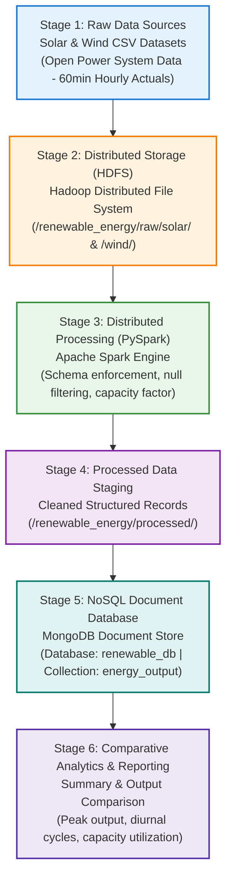

# EXPERIMENT 2 — Project Proposal & Architecture

**Title:** Comparative Study: Solar vs Wind Output  
**Domain:** Renewable Energy Analytics using Big Data Frameworks  
**Architecture Style:** Linear 6-Stage Big Data Ingestion & Processing Pipeline

---

## 1. Aim
To formulate a comprehensive academic project proposal and design a simplified, scalable Big Data architecture for comparative generation analysis between Solar and Wind power systems.

---

## 2. Objective
1. Formulate a structured project proposal detailing the problem statement, objectives, datasets, team roles, and system scope.
2. Design a clean, 6-stage linear data processing architecture suitable for Draw.io and viva defense.
3. Define the exact input, processing logic, and output contract for each architectural component.
4. Establish clear system boundaries by avoiding unnecessary complexity (no Kafka, Airflow, Kubernetes, or complex ML).

---

## 3. Project Proposal

### 3.1 Project Title
**Comparative Study: Solar vs Wind Output**

### 3.2 Problem Statement
Modern electrical power grids increasingly depend on renewable energy sources to decarbonize electricity production. However, both solar and wind energy are inherently intermittent:
- **Solar generation** depends strictly on sunlight and is restricted to daytime hours.
- **Wind generation** fluctuates with atmospheric weather systems but operates day and night.

Power grid operators struggle to maintain grid stability when integrating high volumes of renewable energy. To solve this, operators need an automated Big Data pipeline capable of ingesting hourly generation logs across large territories, cleaning the data, storing it in a queryable NoSQL database, and generating comparative metrics (mean output, peak generation, and capacity factor) to determine how solar and wind complement each other.

### 3.3 Objectives
1. Ingest multi-period hourly power generation time-series from raw CSV storage into HDFS.
2. Utilize Apache Spark (PySpark) for distributed data cleaning, null removal, and capacity factor derivation.
3. Stage cleaned records into MongoDB for high-throughput, schema-flexible querying.
4. Conduct comparative evaluations: identify diurnal vs. continuous generation patterns and evaluate grid stability trade-offs.

### 3.4 Why Compare Solar and Wind?
1. **Complementary Temporal Profiles:** Solar power peaks around midday (11:00–14:00) and produces zero power at night. Wind power often strengthens in the late afternoon and night when consumer demand remains high.
2. **Seasonal Balancing:** In many temperate regions, solar generation reaches maximum levels during summer months, whereas wind generation peaks during stormy winter months.
3. **Grid Reliability:** Analyzing both sources together demonstrates that combining solar and wind reduces the need for fossil-fuel backup plants compared to relying on either source alone.

### 3.5 Dataset Description
- **Primary Source:** [Open Power System Data (OPSD) Time Series](https://data.open-power-system-data.org/time_series/)
- **Data Region:** Germany (`DE`) ENTSO-E transmission grid actuals.
- **Resolution:** 60-minute (hourly) interval.
- **Core Attributes:**
  - `utc_timestamp`: Standardized UTC ISO timestamp.
  - `country`: Regional grid code (`DE`).
  - `source`: Energy category (`Solar` or `Wind`).
  - `power_output_mw`: Actual electrical power generated (MW).
  - `capacity_mw`: Installed capacity of generation assets (MW).

### 3.6 Tools & Technologies
- **Storage Layer:** Hadoop HDFS (raw file block storage).
- **Processing Engine:** Apache Spark / PySpark (distributed DataFrame transformations).
- **Database Layer:** MongoDB (NoSQL document store for fast query retrieval).
- **Analysis & Modeling:** Python (Pandas, Matplotlib) for summary metrics and visual diagrams.
- **Architecture Design:** Draw.io / diagrams.net.

### 3.7 Team Roles & Responsibilities
To reflect realistic industry workflows in a beginner-friendly academic format:
- **Role 1: Data Engineer**
  - Configures the HDFS folder structure (`/renewable_energy/raw/`, `/processed/`).
  - Develops the PySpark ingestion pipeline to clean timestamps and handle null values.
  - Sets up the PyMongo connector to stream processed documents into MongoDB collections.
- **Role 2: Data Analyst**
  - Conducts Exploratory Data Analysis (EDA) on raw and staged datasets.
  - Formulates queries in MongoDB to extract min/max/average generation by time interval.
  - Computes capacity utilization factors and compiles the final comparison tables.
- **Role 3: Data Scientist**
  - Analyzes generation variability and correlation between solar and wind output.
  - Identifies complementary generation windows (e.g., night hours where wind substitutes solar).
  - Prepares the project documentation, architecture diagrams, and viva presentations.

### 3.8 Expected Outcomes
- An operational end-to-end Big Data pipeline moving data from raw CSV files to MongoDB.
- Quantitative verification of solar and wind generation profiles.
- Proof that combined solar and wind generation reduces power output volatility.

### 3.9 Project Limitations
- **Resolution:** Uses hourly resolution data; does not account for sub-minute electrical grid frequency fluctuations.
- **Geography:** Restricted to regional European grid data (Germany); geographical micro-climates are aggregated.
- **No Forecasting:** Focuses strictly on descriptive batch analysis rather than real-time machine learning prediction.

### 3.10 Future Scope
- Adding meteorological data (ambient temperature, wind speed at hub height) to study weather correlation.
- Extending the pipeline to include battery energy storage system (BESS) simulation.
- Deploying a lightweight Streamlit dashboard on top of MongoDB for interactive visualizations.

---

## 4. System Architecture

### 4.1 Architecture Diagram (Linear 6-Stage Pipeline)



### 4.2 Exact Text for Each Architecture Box (For Draw.io)

| Box # | Box Title | Exact Text Inside Box | Role in Pipeline |
| :---: | :--- | :--- | :--- |
| **Box 1** | **Raw Data Sources** | **Solar & Wind CSV Datasets**<br>Open Power System Data (OPSD)<br>Hourly generation & capacity records (DE Grid) | Ingestion source containing hourly energy generation logs. |
| **Box 2** | **Distributed Storage (HDFS)** | **Hadoop HDFS Storage**<br>`/renewable_energy/raw/solar/`<br>`/renewable_energy/raw/wind/` | Reliable distributed file store across cluster blocks. |
| **Box 3** | **Distributed Processing** | **PySpark Processing Engine**<br>• Schema casting & null filtering<br>• Capacity factor calculation<br>• Batch aggregation | In-memory distributed compute engine performing ETL cleaning. |
| **Box 4** | **Processed Data Staging** | **Cleaned Staging Area**<br>`/renewable_energy/processed/`<br>Standardized structured records | Intermediate staging directory before database ingestion. |
| **Box 5** | **NoSQL Database** | **MongoDB Document Store**<br>Database: `renewable_db`<br>Collection: `energy_output` | Schema-free document store for fast indexing and flexible queries. |
| **Box 6** | **Analytics & Comparison** | **Comparative Output & Viva Analytics**<br>• Diurnal vs 24-hr profile<br>• Peak vs average output<br>• Grid complementarity | Business value layer presenting insights and answering research questions. |

---

## 5. Python Script for Diagram Generation

Run the provided script to generate the architecture graphic directly:
```bash
python exp2_generate_architecture.py
```

### Code (`exp2_generate_architecture.py`):
```python
import matplotlib.pyplot as plt
import matplotlib.patches as patches

def draw_architecture():
    fig, ax = plt.subplots(figsize=(10, 8), dpi=300)
    ax.set_xlim(0, 10)
    ax.set_ylim(0, 12)
    ax.axis("off")

    boxes = [
        {"y": 10.0, "title": "Stage 1: Raw Data Sources", "text": "Solar & Wind CSV Datasets\n(Open Power System Data - 60min Hourly Actuals)", "bg": "#E3F2FD", "border": "#1976D2"},
        {"y": 8.0, "title": "Stage 2: Distributed Storage (HDFS)", "text": "Hadoop Distributed File System\n(/renewable_energy/raw/solar/ & /wind/)", "bg": "#FFF3E0", "border": "#F57C00"},
        {"y": 6.0, "title": "Stage 3: Distributed Processing (PySpark)", "text": "Apache Spark Engine\n(Schema enforcement, null filtering, capacity factor calculation)", "bg": "#E8F5E9", "border": "#388E3C"},
        {"y": 4.0, "title": "Stage 4: Processed Data Staging", "text": "Cleaned Structured Records\n(/renewable_energy/processed/)", "bg": "#F3E5F5", "border": "#7B1FA2"},
        {"y": 2.0, "title": "Stage 5: NoSQL Document Database", "text": "MongoDB Document Store\n(Database: renewable_db | Collection: energy_output)", "bg": "#E0F2F1", "border": "#00796B"},
        {"y": 0.3, "title": "Stage 6: Comparative Analytics & Reporting", "text": "Summary & Output Comparison\n(Peak output, diurnal cycles, capacity utilization)", "bg": "#EDE7F6", "border": "#512DA8"}
    ]

    box_width, box_height, box_x = 7.6, 1.15, 1.2
    ax.text(5.0, 11.6, "System Architecture: Solar vs Wind Big Data Pipeline", ha="center", va="center", fontsize=14, fontweight="bold", color="#1A237E")
    ax.text(5.0, 11.2, "Simplified Academic Big Data Laboratory Architecture", ha="center", va="center", fontsize=10, style="italic", color="#424242")

    for i, b in enumerate(boxes):
        y = b["y"]
        rect = patches.FancyBboxPatch((box_x, y), box_width, box_height, boxstyle="round,pad=0.15,rounding_size=0.15", linewidth=2, edgecolor=b["border"], facecolor=b["bg"])
        ax.add_patch(rect)
        ax.text(box_x + box_width / 2, y + 0.82, b["title"], ha="center", va="center", fontsize=10.5, fontweight="bold", color=b["border"])
        ax.text(box_x + box_width / 2, y + 0.38, b["text"], ha="center", va="center", fontsize=9, color="#212121")

        if i < len(boxes) - 1:
            next_y = boxes[i+1]["y"] + box_height + 0.15
            ax.annotate("", xy=(5.0, next_y), xytext=(5.0, y - 0.05), arrowprops=dict(arrowstyle="->,head_width=0.4,head_length=0.4", linewidth=2.2, color="#37474F"))

    plt.tight_layout()
    plt.savefig("architecture_diagram.png", dpi=300, bbox_inches="tight")
    plt.close()
    print("[+] Generated architecture_diagram.png successfully.")

if __name__ == "__main__":
    draw_architecture()
```

---

## 6. Expected Output
1. Generated Image File: `architecture_diagram.png` (High-resolution 300 DPI system diagram).
2. Editable Draw.io File: `architecture.drawio` (Directly importable into [app.diagrams.net](https://app.diagrams.net)).
3. Console Output:
```text
[+] Successfully generated high-res architecture diagram: architecture_diagram.png
```

---

## 7. Result
The project proposal for "Comparative Study: Solar vs Wind Output" has been articulated with clear problem statements, objectives, and team boundaries. A 6-stage linear Big Data architecture connecting HDFS, PySpark, and MongoDB was designed and rendered.

---

## 8. Viva Explanation (Questions & Quick Answers)

**Q1: Why is a linear architecture chosen rather than a complex streaming architecture (e.g., Kafka/Flink)?**  
*Answer:* For batch hourly time-series analysis in an academic laboratory, a linear batch pipeline (HDFS → PySpark → MongoDB) is reliable, reproducible on a single workstation, and minimizes operational overhead while demonstrating all core Big Data principles.

**Q2: What is the specific role of HDFS in this architecture?**  
*Answer:* HDFS serves as the distributed raw data lake. It provides fault-tolerant, high-throughput batch storage where raw solar and wind CSV files are preserved in their original state.

**Q3: Why pass data through PySpark instead of loading CSV directly into MongoDB?**  
*Answer:* Direct ingestion bypasses necessary validation. PySpark cleans the data, casts data types, removes corrupt/null rows, and derives computed metrics (such as Capacity Factor) using distributed cluster memory before persisting to the database.

**Q4: Why use MongoDB as the staging database instead of an RDBMS like MySQL?**  
*Answer:* MongoDB offers schema flexibility and native JSON document storage, making it trivial to store nested time-series attributes and execute rapid queries without rigid schema migrations.

---

## 9. Screenshots to Add in Lab Record
When compiling your lab record for Experiment 2, paste the following 2 items:

1. **Screenshot 1: Generated Architecture Diagram**
   - File: `architecture_diagram.png` (or an exported image from [architecture.drawio](file:///c:/Coding/data%20cleaning/architecture.drawio)).
   - Caption: *Figure 2.1: Six-Stage Big Data Architecture for Solar vs. Wind Comparative Study.*
2. **Screenshot 2: Diagram Generation Script Execution**
   - Command: `python exp2_generate_architecture.py`
   - Content to capture: Terminal window displaying `[+] Successfully generated high-res architecture diagram: architecture_diagram.png`.
